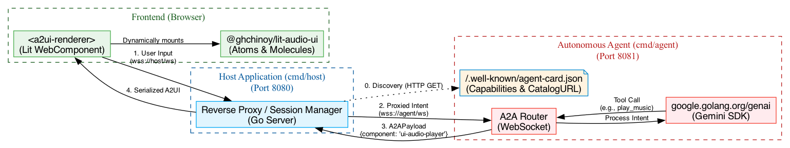

# A2A Simulated Federation Architecture

The `samples/a2a-showcase` project demonstrates how to dynamically orchestrate `@ghchinoy/lit-audio-ui` components using Agent-to-Agent (A2A) protocols. 

Rather than relying on static HTML rendering, this showcase separates concerns into a **Host Application** and an **Autonomous Agent**.

## Architectural Diagram



## Core Concepts

### 1. The Host Application (`cmd/host`)
The Host acts as the traditional "App Shell". It is responsible for:
- Serving the frontend assets (Vite/Lit).
- Maintaining the user session.
- Acting as a **reverse proxy** or routing layer between the frontend UI and the external AI Agent.

### 2. The Autonomous Agent (`cmd/agent`)
The Agent acts as the "LLM Brain". It operates completely independently of the frontend codebase.
- It receives generic user intents (`{"text": "play me a song"}`).
- It invokes LLM Tools (e.g. `google.golang.org/genai` ToolCalls) to determine the correct response.
- It responds using the standard **A2UI Protocol**, returning serialized UI components rather than just text.

### 3. The Lit A2UI Renderer (`a2ui-renderer.ts`)
The true magic happens in the frontend renderer. It maintains a WebSocket connection to the Host and listens for `A2APayload` objects:

```json
{
  "type": "a2ui_render",
  "component": "ui-audio-player",
  "props": {
    "item": {
      "id": "1",
      "src": "gs://bucket/song.mp3"
    }
  }
}
```

Because Lit WebComponents compile down to native HTML tags, the renderer can instantly materialize the LLM's intent using just 3 lines of vanilla JavaScript:

```typescript
const el = document.createElement(payload.component);
Object.assign(el, payload.props); 
this.renderRoot.appendChild(el);
```

### 4. Agent Discovery & A2UI Catalogs
In the A2A ecosystem, a Host must discover an Agent and learn what UI components it supports before it connects to the WebSocket. This is done via an **Agent Card**. 

The Agent Card provides a JSON manifest detailing the Agent's identity, endpoints, and capabilities. Importantly, the Agent declares its support for the A2UI extension and points to the `catalogUrl` (e.g., `a2ui_v0.8_catalog.json`) that maps the Agent's abstract UI concepts to the specific Lit components (`@ghchinoy/lit-audio-ui`) the Host needs to load. You can view the live Agent Card by clicking the **"Connected"** badge in the showcase UI and flipping the card over.

### Why "Simulated" Federation?
In a true federated environment, `cmd/agent` would live on a completely different server, built by a different team, and registered into a global A2A directory. 

For the sake of developer experience, we've bundled both `cmd/host` and `cmd/agent` into this single workspace. When you run `npm run dev`, it launches both backends on ports `8080` and `8081` respectively, simulating a network boundary over `localhost`.